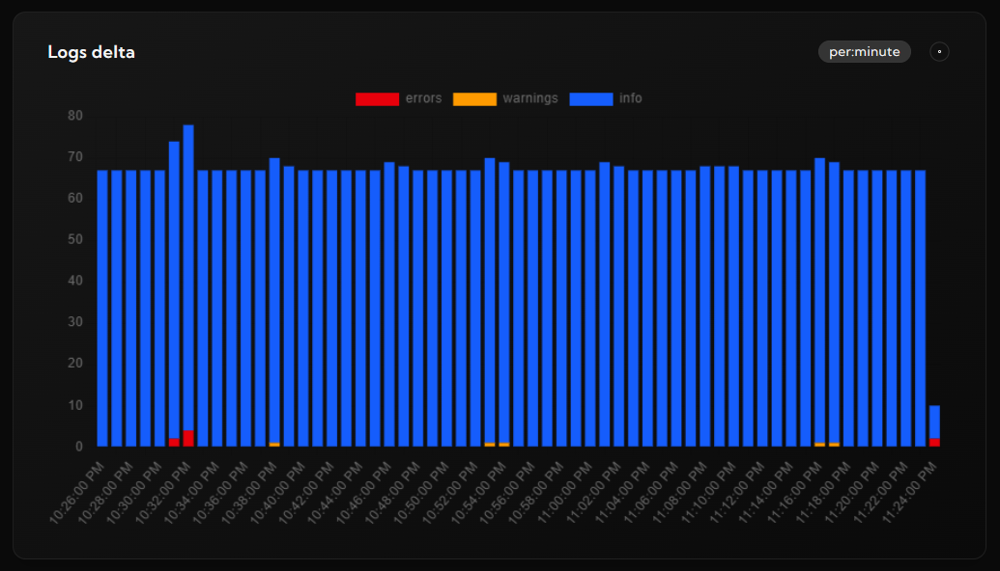
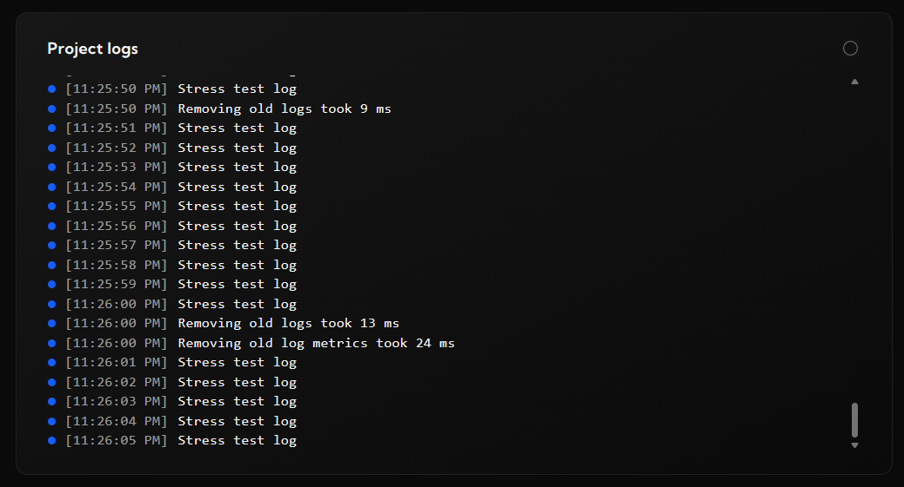

# logdash - node client

Logdash is a simple yet powerful log aggregator and observability platform. This package is a client to use in your app to reach logdash servers.

# Get Started

To use Logdash, you first need to sign up at [logdash.io](https://logdash.io/) and create an API key. It won't take more than 30 seconds.

# Installation

```
npm install @logdash/core
```

# Usage

```typescript
import { createLogDash } from '@logdash/core';

const { logger } = createLogDash({
	API_KEY: '<your-api-key>',
});

logger.info('Application started successfully');
logger.error('An unexpected error occurred');
logger.warning('Low disk space warning');
```

# View

To see the logs, please enter your logdash dashboard





# Configuration Options

asd123

# License

This project is licensed under the MIT License.

# Contributing

Contributions are welcome! Feel free to open issues or submit pull requests.

# Support

If you encounter any issues, please open an issue on GitHub or reach out to our support team.
