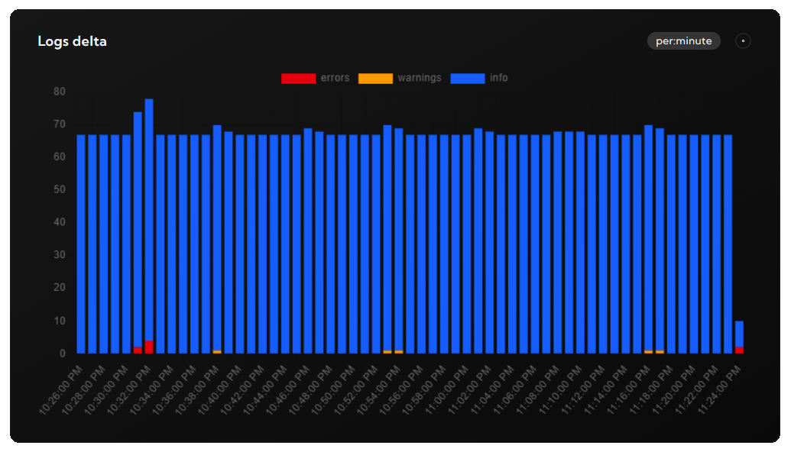

# logdash - JS SDK

Logdash is a zero-config observability platform. This package serves an javascript interface to use it.

# Pre-requisites

Setup your free project in less than 2 minutes at [logdash.io](https://logdash.io/).

# Installation

```
npm install @logdash/js-sdk
```

# Usage

```typescript
import { createLogDash } from '@logdash/js-sdk';

const { logger } = createLogDash({
	apiKey: '<your-api-key>',
});

logger.info('Application started successfully');
logger.error('An unexpected error occurred');
logger.warn('Low disk space warning');
```

# View

To see the logs, go to your project dashboard




# Configuration

| Parameter | Required | Default | Description                                                                                                              |
| --------- | -------- | ------- | ------------------------------------------------------------------------------------------------------------------------ |
| `apiKey`  | no       | -       | Api key used to authorize against logdash servers. If you don't provide one, logs will be logged into local console only |

# License

This project is licensed under the MIT License.

# Contributing

Contributions are welcome! Feel free to open issues or submit pull requests.

# Support

If you encounter any issues, please open an issue on GitHub or let us know at [contact@logdash.io](mailto:contact@logdash.io).
